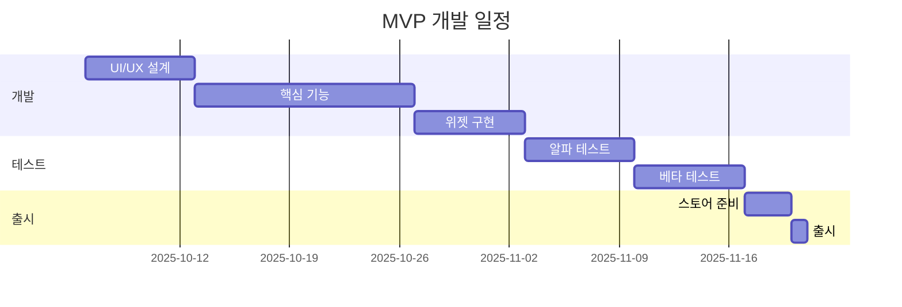

# 📱 RoutineMate PRD v1.0

> **작성일**: 2025.10.05  
> **버전**: MVP v1.0  
> **작성자**: August Kim  
> **상태**: 🟡 Draft

---

## 🎯 Executive Summary

### 제품 비전
"매일 작은 실천을 통해 큰 변화를 만드는 가장 심플한 습관 트래커"

### 핵심 가치 제안
- **Simple**: 3초 안에 오늘의 루틴 체크 완료
- **Visual**: 한눈에 보이는 달성 현황
- **Accessible**: 위젯으로 앱 실행 없이 체크

### MVP 목표
- **기간**: 2025.10 ~ 11 (6주)
- **타겟**: 초기 사용자 500명
- **검증**: 7일 연속 사용률 30% 달성

---

## 📊 시장 분석

### 타겟 사용자
```
👤 Primary Persona: "자기계발 열정러"
- 연령: 25~35세
- 직업: 직장인, 프리랜서
- 특징: 미라클모닝 시도 경험, 자기계발서 독자
- 페인포인트: 복잡한 앱은 부담, 꾸준함 유지 어려움
```

### 경쟁 분석
| 앱 | 강점 | 약점 | 차별화 포인트 |
|---|---|---|---|
| Habitica | 게이미피케이션 | 너무 복잡 | 우리는 심플 |
| Loop Habit | 미니멀 | 재미없음 | 우리는 위젯 강화 |
| Fabulous | 코칭 시스템 | 유료 | 우리는 무료+광고 |

---

## 🛠 기능 명세

### ✅ MVP (P0 - 필수)
<details>
<summary><b>1. 루틴 관리</b></summary>

#### 루틴 추가
- 이름 입력 (최대 20자)
- 아이콘 선택 (30개 프리셋)
- 색상 선택 (8개 옵션)
- 요일 설정 (매일/평일/주말/커스텀)

#### 루틴 체크
- 탭하여 완료 표시
- 완료 시 애니메이션
- 되돌리기 가능

#### 루틴 삭제
- 스와이프로 삭제
- 확인 다이얼로그
</details>

<details>
<summary><b>2. 데이터 저장</b></summary>

- Hive 로컬 DB
- 자동 저장
- 데이터 암호화
</details>

### 🔄 Post-MVP (P1)
<details>
<summary><b>홈 위젯</b></summary>

- 1x1, 2x2, 4x2 크기
- 최대 3개 루틴 표시
- 위젯에서 직접 체크
</details>

<details>
<summary><b>알림</b></summary>

- 시간대별 리마인더
- 격려 메시지
- 스트릭 알림
</details>

### 🚀 Future (P2)
- 통계 대시보드
- AI 일기
- 소셜 기능
- 프리미엄 구독

---

## 💻 기술 스펙

### Tech Stack
```yaml
Framework: Flutter 3.24+
State: Riverpod 2.0
DB: Hive 2.0
Widget: home_widget 0.5
Ads: google_mobile_ads
Analytics: Firebase Analytics
```

### 아키텍처
```
lib/
├── features/
│   ├── routine/
│   │   ├── data/
│   │   ├── domain/
│   │   └── presentation/
│   └── widget/
├── core/
│   ├── theme/
│   └── utils/
└── main.dart
```

### 성능 요구사항
- 콜드 스타트: < 2초
- 위젯 업데이트: < 1초
- 메모리 사용: < 100MB
- 배터리 영향: 최소

---

## 📈 성공 지표

### 핵심 KPI
| 지표 | 목표 | 측정 방법 |
|---|---|---|
| 7-Day Retention | ≥ 30% | Firebase |
| DAU/MAU | ≥ 40% | Analytics |
| 평균 루틴 수 | ≥ 3 | 내부 DB |
| 일일 완료율 | ≥ 50% | 체크 로그 |

### 마일스톤
- **W2**: 알파 버전 완성
- **W4**: 내부 베타 (30명)
- **W6**: Play Store 출시

---

## 💰 비즈니스 모델

### Phase 1: 광고 (MVP)
- AdMob 배너 (하단 고정)
- 예상 RPM: $2~5
- 목표: 비용 상쇄

### Phase 2: 프리미엄 (6개월 후)
```
무료:
- 루틴 5개
- 기본 통계
- 광고 포함

프리미엄 ($2.99/월):
- 무제한 루틴
- AI 분석
- 광고 제거
- 클라우드 백업
```

---

## 🚦 리스크 관리

| 리스크 | 가능성 | 영향 | 대응 |
|---|---|---|---|
| 위젯 기술 이슈 | 높음 | 중간 | 알림으로 대체 |
| 낮은 리텐션 | 중간 | 높음 | 온보딩 강화 |
| 광고 수익 부족 | 중간 | 낮음 | 빠른 프리미엄 전환 |

---

## 📅 타임라인



---

## 🎨 UI/UX 가이드라인

### Design Principles
1. **One-Tap Action**: 모든 주요 동작은 원탭
2. **Visual Feedback**: 즉각적인 시각 피드백
3. **Minimal Depth**: 최대 2단계 네비게이션

### 색상 팔레트
```
Primary: #6366F1 (Indigo)
Success: #10B981 (Green)
Background: #FFFFFF / #1F2937 (Dark)
```

---

## 📝 Appendix

### A. 사용자 스토리
- "사용자는 매일 아침 운동 루틴을 체크하고 싶다"
- "사용자는 위젯에서 바로 물 마시기를 체크하고 싶다"
- "사용자는 일주일간 달성률을 확인하고 싶다"

### B. 참고 자료
- [Flutter Widget 개발 가이드](https://flutter.dev/docs)
- [AdMob 수익화 전략](https://admob.google.com)
- [Habit Tracker 시장 분석 2024](https://example.com)

---

## 📬 Contact

**PM**: August Kim  
**Designer**: TBD  
**Developer**: TBD  
**Email**: august@routinemate.app  

---

*Last Updated: 2025.10.05*