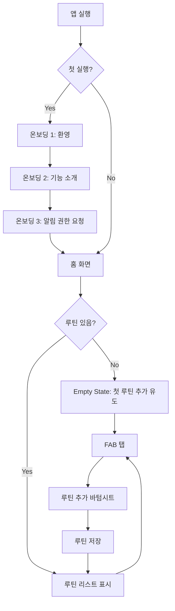
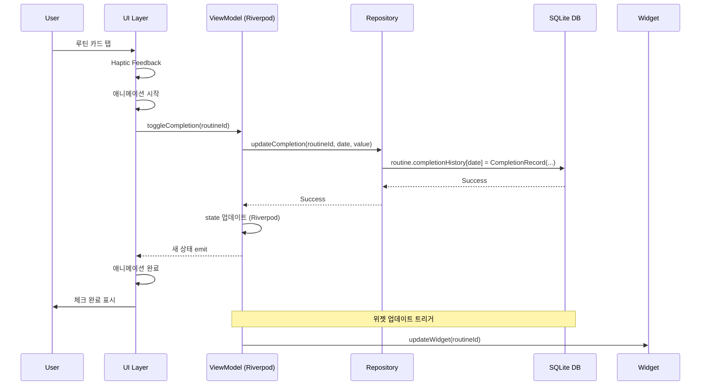
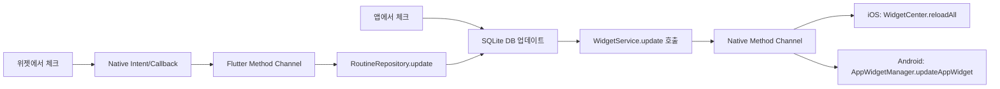

# 📱 RoutineMate 상세 PRD v1.0

> **작성일**: 2025.10.08
> **버전**: MVP v1.0 (Detailed)
> **작성자**: August Kim
> **상태**: 🟢 Ready for Development

---

## 📑 목차
1. [Executive Summary](#-executive-summary)
2. [기능 상세 명세](#-기능-상세-명세)
3. [데이터 스키마](#-데이터-스키마)
4. [화면 플로우](#-화면-플로우)
5. [기술 명세](#-기술-명세)
6. [테스트 시나리오](#-테스트-시나리오)
7. [접근성 요구사항](#-접근성-요구사항)
8. [에러 처리](#-에러-처리)

---

## 🎯 Executive Summary

### 제품 비전
"매일 작은 실천을 통해 큰 변화를 만드는 가장 심플한 습관 트래커"

### 핵심 가치 제안
- **Simple**: 3초 안에 오늘의 루틴 체크 완료
- **Visual**: 한눈에 보이는 달성 현황
- **Accessible**: 위젯으로 앱 실행 없이 체크

---

## 🛠 기능 상세 명세

### 1. 루틴 관리 (MVP - P0)

#### 1.1 루틴 추가
**User Story**: 사용자는 새로운 일상 루틴을 앱에 등록할 수 있다.

**입력 필드**:
```yaml
루틴명:
  - 타입: String
  - 제약: 1-20자, 필수
  - 검증: 공백만 있는 경우 거부
  - 예시: "아침 운동", "물 2L 마시기"

아이콘:
  - 타입: IconPreset (Enum)
  - 옵션: 30개 프리셋
    * 카테고리: 운동(5), 식사(5), 건강(5), 공부(5), 취미(5), 기타(5)
  - 기본값: 체크마크 아이콘
  - 예시: 🏃 💪 📚 💧 🧘

색상:
  - 타입: ColorPreset (Enum)
  - 옵션: 8색 (Indigo, Blue, Green, Yellow, Orange, Red, Pink, Purple)
  - 기본값: Indigo (#6366F1)
  - 접근성: WCAG AA 대비율 준수

요일 설정:
  - 타입: ScheduleType (Enum)
  - 옵션:
    * DAILY: 매일
    * WEEKDAY: 월-금
    * WEEKEND: 토-일
    * CUSTOM: 사용자 지정 (요일 선택)
  - 기본값: DAILY
```

**UI 플로우**:
1. 홈 화면 하단 FAB(+) 버튼 탭
2. 모달 바텀시트 슬라이드업 (애니메이션 300ms)
3. 루틴명 입력 → 아이콘 선택 → 색상 선택 → 요일 설정
4. "추가" 버튼 탭
5. 입력 검증 → 성공 시 홈 화면에 새 루틴 표시 (fade-in 애니메이션)

**Acceptance Criteria**:
- [ ] 루틴명이 20자 초과 시 입력 차단
- [ ] 빈 루틴명으로 저장 시도 시 에러 메시지 표시
- [ ] 아이콘 선택 시 즉각적인 프리뷰 제공
- [ ] CUSTOM 스케줄 선택 시 최소 1개 요일 선택 강제
- [ ] 루틴 추가 완료 후 바텀시트 자동 닫힘
- [ ] 루틴 추가 후 리스트 최상단에 표시
- [ ] 동일한 이름의 루틴 중복 생성 가능 (제한 없음)

**에러 케이스**:
- 루틴명 공백: "루틴 이름을 입력해주세요"
- 루틴명 20자 초과: 입력 차단 + 카운터 표시 (20/20)
- 저장 실패 (DB): "루틴을 저장할 수 없습니다. 다시 시도해주세요"

---

#### 1.2 루틴 체크/언체크
**User Story**: 사용자는 오늘 완료한 루틴을 탭하여 체크할 수 있다.

**동작 명세**:
```yaml
체크 동작:
  - 트리거: 루틴 카드 탭
  - 상태 전환: unchecked → checked
  - 시각 피드백:
    * 체크 아이콘 애니메이션 (scale + fade-in, 250ms)
    * 배경색 변경 (opacity 0.1 → 0.2)
    * Haptic feedback (light impact)
  - 데이터 저장:
    * completionHistory[오늘날짜] = true
    * completedAt: DateTime.now()

언체크 동작:
  - 트리거: 체크된 루틴 카드 재탭
  - 상태 전환: checked → unchecked
  - 시각 피드백:
    * 체크 아이콘 페이드아웃 (200ms)
    * 배경색 원복
    * Haptic feedback (light impact)
  - 데이터 저장:
    * completionHistory[오늘날짜] = false
    * completedAt: null

시간 제약:
  - 자정(00:00) 기준으로 날짜 구분
  - 어제 루틴은 체크 불가 (읽기 전용)
  - 내일 루틴은 미표시
```

**UI 상태**:
```dart
// Unchecked State
Container(
  decoration: BoxDecoration(
    color: routine.color.withOpacity(0.1),
    borderRadius: BorderRadius.circular(16),
  ),
  child: Row(
    children: [
      Icon(routine.icon, color: Colors.grey[400]),
      Text(routine.name, style: TextStyle(color: Colors.black87)),
      // 체크 아이콘 없음
    ],
  ),
)

// Checked State
Container(
  decoration: BoxDecoration(
    color: routine.color.withOpacity(0.2),
    borderRadius: BorderRadius.circular(16),
  ),
  child: Row(
    children: [
      Icon(routine.icon, color: routine.color),
      Text(routine.name, style: TextStyle(color: Colors.black54)),
      Icon(Icons.check_circle, color: routine.color), // 체크 아이콘 표시
    ],
  ),
)
```

**Acceptance Criteria**:
- [ ] 탭 후 200ms 이내 시각 피드백 제공
- [ ] Haptic feedback 정상 작동 (iOS/Android)
- [ ] 체크 상태가 즉시 SQLite DB에 저장
- [ ] 앱 재시작 후에도 체크 상태 유지
- [ ] 오늘 날짜가 아닌 루틴은 체크 불가 (UI 비활성화)
- [ ] 빠른 연속 탭에도 상태 정확히 토글
- [ ] 애니메이션 진행 중에도 탭 가능 (debounce 없음)

**엣지 케이스**:
- 자정 직후 앱 사용 시: 어제 루틴은 체크 불가 상태로 전환
- 날짜 변경선 통과 (해외 여행): 기기 시간대 기준 적용
- 오프라인 상태: 로컬 DB 저장 후 동기화 불필요 (로컬 전용)

---

#### 1.3 루틴 수정
**User Story**: 사용자는 기존 루틴의 정보를 변경할 수 있다.

**입력 필드**: 루틴 추가와 동일

**UI 플로우**:
1. 루틴 카드 길게 누르기 (Long Press, 500ms)
2. 컨텍스트 메뉴 표시: ["수정", "삭제"]
3. "수정" 선택 시 바텀시트 슬라이드업 (현재 값 pre-fill)
4. 필드 수정 후 "저장" 버튼 탭
5. 변경사항 즉시 반영

**Acceptance Criteria**:
- [ ] 기존 값이 모든 필드에 pre-fill
- [ ] 수정 시 completionHistory는 보존
- [ ] 변경사항 저장 후 리스트 순서 유지
- [ ] "취소" 버튼 시 변경사항 폐기

---

#### 1.4 루틴 삭제
**User Story**: 사용자는 더 이상 필요 없는 루틴을 삭제할 수 있다.

**동작 명세**:
```yaml
방법 1: 스와이프 삭제
  - 트리거: 루틴 카드 좌→우 스와이프
  - 애니메이션: 슬라이드 아웃 (300ms)
  - 확인: 없음 (즉시 삭제)
  - Undo: 3초간 Snackbar에 "실행 취소" 버튼 표시

방법 2: 컨텍스트 메뉴
  - 트리거: 루틴 카드 Long Press → "삭제" 선택
  - 확인 다이얼로그:
    title: "루틴 삭제"
    message: "'루틴명'을(를) 삭제하시겠습니까? 모든 기록이 함께 삭제됩니다."
    actions: ["취소", "삭제"]
  - 삭제 버튼 색상: Red
```

**Acceptance Criteria**:
- [ ] 스와이프 삭제 후 3초 이내 실행 취소 가능
- [ ] 실행 취소 시 completionHistory 복원
- [ ] 컨텍스트 메뉴 삭제는 확인 다이얼로그 필수
- [ ] 삭제 시 SQLite DB에서 영구 제거
- [ ] 위젯에 표시 중인 루틴 삭제 시 위젯 자동 업데이트

---

#### 1.5 루틴 정렬/필터링
**User Story**: 사용자는 루틴 목록을 원하는 순서로 볼 수 있다.

**정렬 옵션**:
```yaml
기본: 생성일 역순 (최신 루틴이 위)
옵션 1: 이름 순 (가나다순)
옵션 2: 색상별
옵션 3: 완료율 순 (높은 순)
옵션 4: 커스텀 (드래그 앤 드롭)
```

**필터 옵션**:
```yaml
전체: 모든 루틴
오늘: 오늘 스케줄된 루틴만
완료: 오늘 체크한 루틴만
미완료: 오늘 체크하지 않은 루틴만
```

**Acceptance Criteria**:
- [ ] 정렬/필터 변경 즉시 적용
- [ ] 드래그 앤 드롭 순서 DB에 저장
- [ ] 앱 재시작 후에도 정렬/필터 설정 유지

---

### 2. 홈 위젯 (Post-MVP - P1)

#### 2.1 위젯 구성
**User Story**: 사용자는 홈 화면에서 앱을 열지 않고 루틴을 체크할 수 있다.

**위젯 크기**:
```yaml
Small (1x1):
  - 표시: 1개 루틴
  - 정보: 아이콘 + 이름 + 체크박스
  - 탭 동작: 체크 토글

Medium (2x2):
  - 표시: 최대 3개 루틴
  - 정보: 아이콘 + 이름 + 체크박스 + 진행률 (3/3)
  - 탭 동작: 각 루틴 체크 토글

Large (4x2):
  - 표시: 최대 6개 루틴
  - 정보: 아이콘 + 이름 + 체크박스 + 주간 히트맵
  - 탭 동작: 각 루틴 체크 토글
```

**위젯 설정 플로우**:
1. 홈 화면에서 위젯 추가
2. 크기 선택
3. 앱 내 위젯 설정 화면으로 딥링크
4. 표시할 루틴 선택 (최대 개수까지)
5. 저장 → 위젯 업데이트

**동기화**:
```yaml
위젯 → 앱:
  - 위젯에서 체크 시 앱 DB 즉시 업데이트
  - 앱 실행 시 최신 상태 자동 반영

앱 → 위젯:
  - 앱에서 체크 시 위젯 자동 갱신
  - 루틴 추가/삭제 시 위젯 갱신
  - 백그라운드 갱신 주기: 15분 (iOS), 30분 (Android)
```

**Acceptance Criteria**:
- [ ] 위젯 탭 시 앱 미실행 상태에서도 체크 가능
- [ ] 위젯-앱 간 체크 상태 실시간 동기화
- [ ] 자정 이후 위젯 자동 리셋
- [ ] 배터리 사용 최소화 (<1% per day)

---

### 3. 알림 시스템 (Post-MVP - P1)

#### 3.1 루틴 리마인더
**User Story**: 사용자는 설정한 시간에 루틴 알림을 받을 수 있다.

**알림 설정**:
```yaml
시간 설정:
  - 루틴별 개별 설정
  - 시간 선택: Time Picker
  - 반복: 스케줄에 따라 자동 (매일/평일/주말/커스텀)

알림 내용:
  title: "🔔 [루틴명] 시간이에요!"
  body: "오늘도 작은 실천을 시작해보세요"
  icon: 루틴 아이콘
  action: 앱 열기 → 해당 루틴 하이라이트
```

#### 3.2 격려 알림
**User Story**: 사용자는 스트릭 달성 시 축하 알림을 받는다.

**알림 트리거**:
```yaml
3일 연속:
  title: "🔥 3일 연속 달성!"
  body: "'[루틴명]'을(를) 3일 연속 완료했어요!"

7일 연속:
  title: "⭐ 일주일 달성!"
  body: "놀라워요! '[루틴명]' 일주일 연속 완료!"

30일 연속:
  title: "🏆 한 달 완주!"
  body: "대단해요! '[루틴명]' 30일 연속 성공!"
```

**Acceptance Criteria**:
- [ ] 알림 권한 거부 시 설정 유도 다이얼로그
- [ ] 알림 탭 시 앱 열리며 해당 루틴으로 스크롤
- [ ] Do Not Disturb 모드 존중 (iOS/Android)
- [ ] 알림 개별 on/off 설정 가능

---

## 💾 데이터 스키마

### 데이터베이스 스키마

#### 1. 테이블 구조
```sql
-- routines 테이블
CREATE TABLE routines (
    id TEXT PRIMARY KEY,
    name TEXT NOT NULL CHECK(length(name) BETWEEN 1 AND 20),
    icon_index INTEGER NOT NULL CHECK(icon_index BETWEEN 0 AND 29),
    color_index INTEGER NOT NULL CHECK(color_index BETWEEN 0 AND 7),
    schedule_type TEXT NOT NULL CHECK(schedule_type IN ('DAILY', 'WEEKDAY', 'WEEKEND', 'CUSTOM')),
    custom_days TEXT, -- JSON array: [1,2,3,4,5]
    sort_order INTEGER NOT NULL DEFAULT 0,
    reminder_time TEXT, -- HH:mm format
    is_reminder_enabled INTEGER DEFAULT 0,
    created_at TEXT NOT NULL DEFAULT CURRENT_TIMESTAMP,
    updated_at TEXT NOT NULL DEFAULT CURRENT_TIMESTAMP,
    deleted_at TEXT -- Soft delete
);

-- completion_records 테이블
CREATE TABLE completion_records (
    id INTEGER PRIMARY KEY AUTOINCREMENT,
    routine_id TEXT NOT NULL,
    date TEXT NOT NULL, -- YYYY-MM-DD format
    is_completed INTEGER NOT NULL DEFAULT 0,
    completed_at TEXT,
    note TEXT,
    created_at TEXT NOT NULL DEFAULT CURRENT_TIMESTAMP,
    FOREIGN KEY (routine_id) REFERENCES routines(id) ON DELETE CASCADE,
    UNIQUE(routine_id, date)
);

-- app_settings 테이블
CREATE TABLE app_settings (
    key TEXT PRIMARY KEY,
    value TEXT NOT NULL,
    updated_at TEXT NOT NULL DEFAULT CURRENT_TIMESTAMP
);

-- analytics_data 테이블
CREATE TABLE analytics_data (
    id INTEGER PRIMARY KEY AUTOINCREMENT,
    date TEXT NOT NULL UNIQUE,
    total_routines INTEGER DEFAULT 0,
    completed_routines INTEGER DEFAULT 0,
    app_open_count INTEGER DEFAULT 0,
    check_from_widget INTEGER DEFAULT 0,
    check_from_app INTEGER DEFAULT 0,
    created_at TEXT NOT NULL DEFAULT CURRENT_TIMESTAMP
);

-- 인덱스
CREATE INDEX idx_routines_deleted_at ON routines(deleted_at);
CREATE INDEX idx_completion_records_routine_date ON completion_records(routine_id, date);
CREATE INDEX idx_analytics_data_date ON analytics_data(date);
```

#### 2. Routine Model (Dart)
```dart
class Routine {
  late String id; // UUID v4
  late String name; // 1-20자
  late int iconIndex; // 0-29 (프리셋 인덱스)
  late int colorIndex; // 0-7 (색상 인덱스)
  late ScheduleType scheduleType; // DAILY, WEEKDAY, WEEKEND, CUSTOM
  late List<int>? customDays; // [0=Mon, 1=Tue, ..., 6=Sun], CUSTOM일 때만
  late DateTime createdAt;
  late DateTime updatedAt;
  late int sortOrder; // 커스텀 정렬용
  late Map<String, CompletionRecord> completionHistory;
  late String? reminderTime; // "HH:mm" or null
  late bool isReminderEnabled; // default: false

  // Computed properties
  bool get isCompletedToday {
    final today = DateFormat('yyyy-MM-dd').format(DateTime.now());
    return completionHistory[today]?.isCompleted ?? false;
  }

  int get currentStreak {
    // 연속 완료 일수 계산 로직
  }

  double get completionRate {
    // 전체 완료율 계산 (최근 30일 기준)
  }
}

class CompletionRecord {
  late bool isCompleted;
  late DateTime? completedAt;
  late String? note; // 메모 (미래 기능)
}

enum ScheduleType {
  DAILY,
  WEEKDAY,
  WEEKEND,
  CUSTOM,
}
```

#### 3. Settings Model
```dart
class AppSettings {
  late bool isDarkMode; // default: false
  late String sortOrder; // "created", "name", "color", "completion", "custom"
  late String filterType; // "all", "today", "completed", "incomplete"
  late bool isFirstLaunch; // default: true
  late bool hasCompletedOnboarding; // default: false
  late bool isNotificationEnabled; // default: false
  late List<String> widgetRoutineIds; // 위젯에 표시할 루틴 ID 목록
}
```

#### 4. Analytics Model (Local)
```dart
class AnalyticsData {
  late DateTime date;
  late int totalRoutines;
  late int completedRoutines;
  late int appOpenCount;
  late int checkFromWidget; // 위젯에서 체크한 횟수
  late int checkFromApp; // 앱에서 체크한 횟수
}
```

### 데이터베이스 초기화
```dart
class DatabaseHelper {
  static const String _databaseName = 'routine_mate.db';
  static const int _databaseVersion = 1;

  Database? _database;

  Future<Database> get database async {
    _database ??= await _initDatabase();
    return _database!;
  }

  Future<Database> _initDatabase() async {
    final path = join(await getDatabasesPath(), _databaseName);

    return await openDatabase(
      path,
      version: _databaseVersion,
      onCreate: _onCreate,
      onUpgrade: _onUpgrade,
    );
  }

  Future<void> _onCreate(Database db, int version) async {
    // 테이블 생성
    await db.execute('''
      CREATE TABLE routines (
        id TEXT PRIMARY KEY,
        name TEXT NOT NULL,
        icon_index INTEGER NOT NULL,
        color_index INTEGER NOT NULL,
        schedule_type TEXT NOT NULL,
        custom_days TEXT,
        sort_order INTEGER DEFAULT 0,
        reminder_time TEXT,
        is_reminder_enabled INTEGER DEFAULT 0,
        created_at TEXT DEFAULT CURRENT_TIMESTAMP,
        updated_at TEXT DEFAULT CURRENT_TIMESTAMP,
        deleted_at TEXT
      )
    ''');

    await db.execute('''
      CREATE TABLE completion_records (
        id INTEGER PRIMARY KEY AUTOINCREMENT,
        routine_id TEXT NOT NULL,
        date TEXT NOT NULL,
        is_completed INTEGER DEFAULT 0,
        completed_at TEXT,
        note TEXT,
        created_at TEXT DEFAULT CURRENT_TIMESTAMP,
        FOREIGN KEY (routine_id) REFERENCES routines(id) ON DELETE CASCADE,
        UNIQUE(routine_id, date)
      )
    ''');

    // 인덱스 생성
    await db.execute('CREATE INDEX idx_routines_deleted_at ON routines(deleted_at)');
    await db.execute('CREATE INDEX idx_completion_records_routine_date ON completion_records(routine_id, date)');
  }
}
```

---

## 📱 화면 플로우

### 1. 앱 실행 플로우


### 2. 루틴 체크 플로우


### 3. 위젯 동기화 플로우


---

## 🔧 기술 명세

### 1. 상태 관리 (Riverpod)

#### Provider 구조
```dart
// Repository Provider
final routineRepositoryProvider = Provider<RoutineRepository>((ref) {
  final dbHelper = DatabaseHelper();
  return RoutineRepositoryImpl(RoutineDao(dbHelper));
});

// Routine List Provider
final routineListProvider = StateNotifierProvider<RoutineListNotifier, AsyncValue<List<Routine>>>((ref) {
  final repository = ref.watch(routineRepositoryProvider);
  return RoutineListNotifier(repository);
});

// Filter/Sort Provider
final routineFilterProvider = StateProvider<FilterType>((ref) => FilterType.all);
final routineSortProvider = StateProvider<SortType>((ref) => SortType.created);

// Filtered Routine List Provider (computed)
final filteredRoutineListProvider = Provider<AsyncValue<List<Routine>>>((ref) {
  final routines = ref.watch(routineListProvider);
  final filter = ref.watch(routineFilterProvider);
  final sort = ref.watch(routineSortProvider);

  return routines.whenData((list) {
    var filtered = _applyFilter(list, filter);
    var sorted = _applySort(filtered, sort);
    return sorted;
  });
});

// Today's Completion Provider
final todayCompletionProvider = Provider<AsyncValue<CompletionStats>>((ref) {
  final routines = ref.watch(filteredRoutineListProvider);
  return routines.whenData((list) {
    final today = list.where((r) => r.isScheduledToday());
    final completed = today.where((r) => r.isCompletedToday);
    return CompletionStats(
      total: today.length,
      completed: completed.length,
      percentage: completed.length / today.length * 100,
    );
  });
});
```

#### ViewModel Example
```dart
class RoutineListNotifier extends StateNotifier<AsyncValue<List<Routine>>> {
  final RoutineRepository _repository;

  RoutineListNotifier(this._repository) : super(const AsyncValue.loading()) {
    _loadRoutines();
  }

  Future<void> _loadRoutines() async {
    state = const AsyncValue.loading();
    try {
      final routines = await _repository.getAllRoutines();
      state = AsyncValue.data(routines);
    } catch (e, st) {
      state = AsyncValue.error(e, st);
    }
  }

  Future<void> addRoutine(Routine routine) async {
    await _repository.addRoutine(routine);
    await _loadRoutines();
  }

  Future<void> toggleCompletion(String routineId) async {
    // Optimistic update
    state.whenData((routines) {
      final index = routines.indexWhere((r) => r.id == routineId);
      if (index != -1) {
        final updated = [...routines];
        updated[index] = routines[index].copyWith(
          isCompletedToday: !routines[index].isCompletedToday,
        );
        state = AsyncValue.data(updated);
      }
    });

    try {
      await _repository.toggleCompletion(routineId, DateTime.now());
    } catch (e) {
      // Revert on error
      await _loadRoutines();
      rethrow;
    }
  }

  Future<void> deleteRoutine(String routineId) async {
    await _repository.deleteRoutine(routineId);
    await _loadRoutines();
  }
}
```

### 2. Repository 패턴

```dart
abstract class RoutineRepository {
  Future<List<Routine>> getAllRoutines();
  Future<Routine?> getRoutineById(String id);
  Future<void> addRoutine(Routine routine);
  Future<void> updateRoutine(Routine routine);
  Future<void> deleteRoutine(String id);
  Future<void> toggleCompletion(String id, DateTime date);
  Stream<List<Routine>> watchRoutines();
}

class RoutineRepositoryImpl implements RoutineRepository {
  final Box<Routine> _box;

  RoutineRepositoryImpl(this._box);

  @override
  Future<List<Routine>> getAllRoutines() async {
    return _box.values.toList()
      ..sort((a, b) => b.createdAt.compareTo(a.createdAt));
  }

  @override
  Future<void> toggleCompletion(String id, DateTime date) async {
    final routine = _box.get(id);
    if (routine == null) throw RoutineNotFoundException(id);

    final dateKey = DateFormat('yyyy-MM-dd').format(date);
    final currentValue = routine.completionHistory[dateKey]?.isCompleted ?? false;

    routine.completionHistory[dateKey] = CompletionRecord()
      ..isCompleted = !currentValue
      ..completedAt = !currentValue ? DateTime.now() : null;

    await routine.save();

    // 위젯 업데이트 트리거
    await WidgetService.updateWidget(id);
  }

  @override
  Stream<List<Routine>> watchRoutines() {
    return _box.watch().map((_) => getAllRoutines());
  }
}
```

### 3. 위젯 통합 (iOS/Android)

#### Flutter Service
```dart
class WidgetService {
  static const platform = MethodChannel('com.routinemate.app/widget');

  static Future<void> updateWidget(String routineId) async {
    try {
      final routine = await _getRoutine(routineId);
      await platform.invokeMethod('updateWidget', {
        'routineId': routine.id,
        'name': routine.name,
        'iconIndex': routine.iconIndex,
        'colorIndex': routine.colorIndex,
        'isCompleted': routine.isCompletedToday,
      });
    } on PlatformException catch (e) {
      debugPrint("Failed to update widget: ${e.message}");
    }
  }

  static Future<void> updateAllWidgets() async {
    try {
      final settings = await _getSettings();
      final routines = await _getRoutines(settings.widgetRoutineIds);

      await platform.invokeMethod('updateAllWidgets', {
        'routines': routines.map((r) => r.toJson()).toList(),
      });
    } on PlatformException catch (e) {
      debugPrint("Failed to update widgets: ${e.message}");
    }
  }

  static void setupMethodCallHandler() {
    platform.setMethodCallHandler((call) async {
      switch (call.method) {
        case 'toggleFromWidget':
          final routineId = call.arguments['routineId'] as String;
          await _toggleRoutineFromWidget(routineId);
          break;
      }
    });
  }
}
```

#### iOS Widget (SwiftUI)
```swift
// RoutineWidget.swift
struct RoutineWidget: Widget {
    let kind: String = "RoutineWidget"

    var body: some WidgetConfiguration {
        StaticConfiguration(kind: kind, provider: Provider()) { entry in
            RoutineWidgetEntryView(entry: entry)
        }
        .configurationDisplayName("루틴 체크")
        .description("홈 화면에서 바로 루틴을 체크하세요")
        .supportedFamilies([.systemSmall, .systemMedium, .systemLarge])
    }
}

struct RoutineWidgetEntryView: View {
    var entry: Provider.Entry

    var body: some View {
        VStack {
            ForEach(entry.routines) { routine in
                HStack {
                    Image(systemName: routine.icon)
                    Text(routine.name)
                    Spacer()
                    Button(action: {
                        toggleRoutine(routine.id)
                    }) {
                        Image(systemName: routine.isCompleted ? "checkmark.circle.fill" : "circle")
                    }
                }
            }
        }
        .padding()
    }

    func toggleRoutine(_ id: String) {
        // Flutter Method Channel 호출
        FlutterMethodChannel.invokeMethod("toggleFromWidget", arguments: ["routineId": id])
        WidgetCenter.shared.reloadAllTimelines()
    }
}
```

#### Android Widget (Kotlin)
```kotlin
// RoutineWidgetProvider.kt
class RoutineWidgetProvider : AppWidgetProvider() {
    override fun onUpdate(context: Context, appWidgetManager: AppWidgetManager, appWidgetIds: IntArray) {
        for (appWidgetId in appWidgetIds) {
            updateAppWidget(context, appWidgetManager, appWidgetId)
        }
    }

    private fun updateAppWidget(context: Context, appWidgetManager: AppWidgetManager, appWidgetId: Int) {
        val routines = getRoutinesFromSharedPrefs(context)
        val views = RemoteViews(context.packageName, R.layout.widget_routine)

        routines.forEachIndexed { index, routine ->
            val checkboxId = getCheckboxId(index)
            views.setImageViewResource(checkboxId, if (routine.isCompleted) R.drawable.ic_checked else R.drawable.ic_unchecked)
            views.setTextViewText(getTextViewId(index), routine.name)

            // ��크박스 클릭 리스너
            val intent = Intent(context, RoutineWidgetProvider::class.java).apply {
                action = ACTION_TOGGLE_ROUTINE
                putExtra(EXTRA_ROUTINE_ID, routine.id)
            }
            val pendingIntent = PendingIntent.getBroadcast(context, routine.id.hashCode(), intent, PendingIntent.FLAG_UPDATE_CURRENT)
            views.setOnClickPendingIntent(checkboxId, pendingIntent)
        }

        appWidgetManager.updateAppWidget(appWidgetId, views)
    }

    override fun onReceive(context: Context, intent: Intent) {
        super.onReceive(context, intent)
        if (intent.action == ACTION_TOGGLE_ROUTINE) {
            val routineId = intent.getStringExtra(EXTRA_ROUTINE_ID)
            // Flutter Method Channel 호출
            MainActivity.methodChannel?.invokeMethod("toggleFromWidget", mapOf("routineId" to routineId))
        }
    }

    companion object {
        const val ACTION_TOGGLE_ROUTINE = "com.routinemate.app.TOGGLE_ROUTINE"
        const val EXTRA_ROUTINE_ID = "routine_id"
    }
}
```

### 4. 알림 시스템

```dart
class NotificationService {
  final FlutterLocalNotificationsPlugin _notifications = FlutterLocalNotificationsPlugin();

  Future<void> initialize() async {
    const initializationSettingsAndroid = AndroidInitializationSettings('@mipmap/ic_launcher');
    const initializationSettingsIOS = DarwinInitializationSettings(
      requestAlertPermission: false,
      requestBadgePermission: false,
      requestSoundPermission: false,
    );

    await _notifications.initialize(
      const InitializationSettings(
        android: initializationSettingsAndroid,
        iOS: initializationSettingsIOS,
      ),
      onDidReceiveNotificationResponse: _onNotificationTapped,
    );
  }

  Future<void> scheduleRoutineReminder(Routine routine) async {
    if (!routine.isReminderEnabled || routine.reminderTime == null) return;

    final time = TimeOfDay.fromDateTime(
      DateFormat('HH:mm').parse(routine.reminderTime!),
    );

    await _notifications.zonedSchedule(
      routine.id.hashCode,
      '🔔 ${routine.name} 시간이에요!',
      '오늘도 작은 실천을 시작해보세요',
      _nextInstanceOfTime(time),
      const NotificationDetails(
        android: AndroidNotificationDetails(
          'routine_reminder',
          '루틴 리마인더',
          importance: Importance.high,
          priority: Priority.high,
        ),
        iOS: DarwinNotificationDetails(),
      ),
      androidScheduleMode: AndroidScheduleMode.exactAllowWhileIdle,
      uiLocalNotificationDateInterpretation: UILocalNotificationDateInterpretation.absoluteTime,
      matchDateTimeComponents: DateTimeComponents.time,
      payload: jsonEncode({'routineId': routine.id}),
    );
  }

  Future<void> showStreakNotification(Routine routine, int streakDays) async {
    String title, body;
    switch (streakDays) {
      case 3:
        title = '🔥 3일 연속 달성!';
        body = '${routine.name}을(를) 3일 연속 완료했어요!';
        break;
      case 7:
        title = '⭐ 일주일 달성!';
        body = '놀라워요! ${routine.name} 일주일 연속 완료!';
        break;
      case 30:
        title = '🏆 한 달 완주!';
        body = '대단해요! ${routine.name} 30일 연속 성공!';
        break;
      default:
        return;
    }

    await _notifications.show(
      routine.id.hashCode + streakDays,
      title,
      body,
      const NotificationDetails(
        android: AndroidNotificationDetails(
          'streak_celebration',
          '스트릭 축하',
          importance: Importance.max,
          priority: Priority.max,
        ),
        iOS: DarwinNotificationDetails(),
      ),
      payload: jsonEncode({'routineId': routine.id}),
    );
  }

  void _onNotificationTapped(NotificationResponse response) {
    if (response.payload != null) {
      final data = jsonDecode(response.payload!);
      final routineId = data['routineId'];
      // Navigate to routine detail or highlight in list
      navigatorKey.currentState?.pushNamed('/home', arguments: routineId);
    }
  }

  tz.TZDateTime _nextInstanceOfTime(TimeOfDay time) {
    final now = tz.TZDateTime.now(tz.local);
    var scheduledDate = tz.TZDateTime(
      tz.local,
      now.year,
      now.month,
      now.day,
      time.hour,
      time.minute,
    );
    if (scheduledDate.isBefore(now)) {
      scheduledDate = scheduledDate.add(const Duration(days: 1));
    }
    return scheduledDate;
  }
}
```

---

## ✅ 테스트 시나리오

### 1. Unit Tests

#### Routine Model Tests
```dart
group('Routine Model', () {
  test('isCompletedToday returns true when completed today', () {
    final routine = Routine()
      ..id = 'test-1'
      ..name = 'Test'
      ..completionHistory = {
        DateFormat('yyyy-MM-dd').format(DateTime.now()): CompletionRecord()
          ..isCompleted = true
          ..completedAt = DateTime.now(),
      };

    expect(routine.isCompletedToday, true);
  });

  test('currentStreak calculates correctly', () {
    final now = DateTime.now();
    final routine = Routine()
      ..id = 'test-1'
      ..completionHistory = {
        DateFormat('yyyy-MM-dd').format(now): CompletionRecord()..isCompleted = true,
        DateFormat('yyyy-MM-dd').format(now.subtract(Duration(days: 1))): CompletionRecord()..isCompleted = true,
        DateFormat('yyyy-MM-dd').format(now.subtract(Duration(days: 2))): CompletionRecord()..isCompleted = true,
        DateFormat('yyyy-MM-dd').format(now.subtract(Duration(days: 3))): CompletionRecord()..isCompleted = false,
      };

    expect(routine.currentStreak, 3);
  });

  test('validates name length', () {
    expect(() => Routine()..name = '', throwsA(isA<ValidationException>()));
    expect(() => Routine()..name = 'a' * 21, throwsA(isA<ValidationException>()));
    expect(() => Routine()..name = '운동하기', returnsNormally);
  });
});
```

#### Repository Tests
```dart
group('RoutineRepository', () {
  late Box<Routine> mockBox;
  late RoutineRepository repository;

  setUp(() {
    mockBox = MockBox<Routine>();
    repository = RoutineRepositoryImpl(mockBox);
  });

  test('getAllRoutines returns sorted list', () async {
    when(mockBox.values).thenReturn([
      Routine()..id = '1'..createdAt = DateTime(2025, 1, 1),
      Routine()..id = '2'..createdAt = DateTime(2025, 1, 3),
      Routine()..id = '3'..createdAt = DateTime(2025, 1, 2),
    ]);

    final routines = await repository.getAllRoutines();

    expect(routines[0].id, '2'); // 최신순
    expect(routines[1].id, '3');
    expect(routines[2].id, '1');
  });

  test('toggleCompletion updates completion history', () async {
    final routine = Routine()
      ..id = 'test-1'
      ..completionHistory = {};

    when(mockBox.get('test-1')).thenReturn(routine);

    await repository.toggleCompletion('test-1', DateTime.now());

    final dateKey = DateFormat('yyyy-MM-dd').format(DateTime.now());
    expect(routine.completionHistory[dateKey]?.isCompleted, true);
    verify(routine.save()).called(1);
  });
});
```

### 2. Widget Tests

#### Routine Card Widget Test
```dart
testWidgets('Routine card shows check icon when completed', (tester) async {
  final routine = Routine()
    ..id = 'test-1'
    ..name = '운동하기'
    ..iconIndex = 0
    ..colorIndex = 0
    ..completionHistory = {
      DateFormat('yyyy-MM-dd').format(DateTime.now()): CompletionRecord()
        ..isCompleted = true,
    };

  await tester.pumpWidget(
    MaterialApp(
      home: Scaffold(
        body: RoutineCard(routine: routine),
      ),
    ),
  );

  expect(find.byIcon(Icons.check_circle), findsOneWidget);
  expect(find.text('운동하기'), findsOneWidget);
});

testWidgets('Tapping routine card triggers haptic feedback', (tester) async {
  final routine = Routine()..id = 'test-1'..name = 'Test';
  final hapticCalled = <bool>[];

  await tester.pumpWidget(
    MaterialApp(
      home: Scaffold(
        body: RoutineCard(
          routine: routine,
          onTap: () {
            HapticFeedback.lightImpact();
            hapticCalled.add(true);
          },
        ),
      ),
    ),
  );

  await tester.tap(find.byType(RoutineCard));
  await tester.pump();

  expect(hapticCalled, isNotEmpty);
});
```

### 3. Integration Tests

#### End-to-End: 루틴 추가 및 체크
```dart
testWidgets('User can add and check a routine', (tester) async {
  app.main();
  await tester.pumpAndSettle();

  // FAB 탭
  await tester.tap(find.byIcon(Icons.add));
  await tester.pumpAndSettle();

  // 루틴명 입력
  await tester.enterText(find.byType(TextField), '아침 운동');

  // 아이콘 선택
  await tester.tap(find.byIcon(Icons.fitness_center));
  await tester.pumpAndSettle();

  // 저장
  await tester.tap(find.text('추가'));
  await tester.pumpAndSettle();

  // 루틴 카드 확인
  expect(find.text('아침 운동'), findsOneWidget);
  expect(find.byIcon(Icons.check_circle), findsNothing); // 아직 미체크

  // 루틴 체크
  await tester.tap(find.text('아침 운동'));
  await tester.pumpAndSettle();

  // 체크 아이콘 확인
  expect(find.byIcon(Icons.check_circle), findsOneWidget);

  // DB 확인
  final db = await DatabaseHelper().database;
  final results = await db.query('routines');
  final routine = results.first;
  expect(routine.name, '아침 운동');
  expect(routine.isCompletedToday, true);
});
```

### 4. Performance Tests

```dart
test('Routine list renders 100 items in <16ms', () async {
  final routines = List.generate(100, (i) => Routine()
    ..id = 'routine-$i'
    ..name = '루틴 $i');

  final stopwatch = Stopwatch()..start();

  await tester.pumpWidget(
    MaterialApp(
      home: RoutineListView(routines: routines),
    ),
  );

  stopwatch.stop();
  expect(stopwatch.elapsedMilliseconds, lessThan(16)); // 60fps
});

test('Toggle completion completes in <200ms', () async {
  final dbHelper = DatabaseHelper();
  final repository = RoutineRepositoryImpl(RoutineDao(dbHelper));
  final routine = Routine()..id = 'test';
  await repository.addRoutine(routine);

  final stopwatch = Stopwatch()..start();
  await repository.toggleCompletion('test', DateTime.now());
  stopwatch.stop();

  expect(stopwatch.elapsedMilliseconds, lessThan(200));
});
```

---

## ♿ 접근성 요구사항

### 1. 색상 및 대비
```yaml
색상 대비율:
  - 모든 텍스트: WCAG AA 기준 충족 (최소 4.5:1)
  - 큰 텍스트 (18pt+): 3:1 이상
  - 아이콘: 3:1 이상

다크모드:
  - 시스템 설정 자동 감지
  - 수동 전환 옵션 제공
  - 모든 화면 다크모드 지원

색맹 고려:
  - 색상만으로 정보 전달 금지
  - 체크 상태는 아이콘으로도 표시
  - 루틴 구분 시 아이콘도 함께 사용
```

### 2. Semantic Labels
```dart
// 예시
Semantics(
  label: '아침 운동 루틴, 완료됨',
  button: true,
  child: RoutineCard(
    routine: routine,
    onTap: () => toggleRoutine(routine.id),
  ),
)

// FAB
Semantics(
  label: '새 루틴 추가',
  hint: '탭하여 새로운 루틴을 만드세요',
  button: true,
  child: FloatingActionButton(...),
)

// 체크박스
Semantics(
  label: '${routine.name}, ${routine.isCompletedToday ? "완료됨" : "미완료"}',
  checked: routine.isCompletedToday,
  child: Checkbox(...),
)
```

### 3. 터치 영역
```yaml
최소 터치 영역:
  - 모든 인터랙티브 요소: 48x48 dp (Material Design 기준)
  - 루틴 카드 높이: 최소 64dp
  - FAB 크기: 56x56 dp

여백:
  - 카드 간 간격: 12dp
  - 화면 좌우 패딩: 16dp
```

### 4. VoiceOver / TalkBack 지원
```yaml
필수 구현:
  - 모든 버튼에 명확한 레이블
  - 동적 콘텐츠 변경 시 알림 (예: 루틴 체크 완료)
  - 포커스 순서 논리적으로 구성
  - 이미지에 대체 텍스트 제공

테스트:
  - iOS VoiceOver로 전체 플로우 테스트
  - Android TalkBack으로 전체 플로우 테스트
```

---

## ⚠️ 에러 처리

### 1. 네트워크 에러
```yaml
시나리오: (현재 MVP는 로컬 전용이므로 해당 없음)
향후 클라우드 동기화 시:
  - 오프라인 상태: 로컬 저장 후 온라인 시 자동 동기화
  - 동기화 실패: 재시도 로직 (exponential backoff)
  - 충돌 해결: Last-write-wins 전략
```

### 2. DB 에러
```dart
class DatabaseException implements Exception {
  final String message;
  final dynamic originalError;

  DatabaseException(this.message, [this.originalError]);
}

// Repository에서 처리
Future<void> addRoutine(Routine routine) async {
  try {
    await _box.put(routine.id, routine);
  } catch (e) {
    throw DatabaseException('루틴을 저장할 수 없습니다', e);
  }
}

// UI에서 처리
void _onAddRoutine() async {
  try {
    await ref.read(routineListProvider.notifier).addRoutine(newRoutine);
    ScaffoldMessenger.of(context).showSnackBar(
      SnackBar(content: Text('루틴이 추가되었습니다')),
    );
  } on DatabaseException catch (e) {
    ScaffoldMessenger.of(context).showSnackBar(
      SnackBar(
        content: Text(e.message),
        action: SnackBarAction(label: '재시도', onPressed: _onAddRoutine),
      ),
    );
  }
}
```

### 3. 권한 에러
```dart
class PermissionService {
  Future<bool> requestNotificationPermission() async {
    final status = await Permission.notification.request();

    if (status.isDenied) {
      _showPermissionDeniedDialog();
      return false;
    } else if (status.isPermanentlyDenied) {
      _showOpenSettingsDialog();
      return false;
    }

    return status.isGranted;
  }

  void _showPermissionDeniedDialog() {
    showDialog(
      context: context,
      builder: (context) => AlertDialog(
        title: Text('알림 권한 필요'),
        content: Text('루틴 리마인더를 받으려면 알림 권한이 필요합니다.'),
        actions: [
          TextButton(
            onPressed: () => Navigator.pop(context),
            child: Text('나중에'),
          ),
          TextButton(
            onPressed: () {
              Navigator.pop(context);
              requestNotificationPermission();
            },
            child: Text('허용'),
          ),
        ],
      ),
    );
  }

  void _showOpenSettingsDialog() {
    showDialog(
      context: context,
      builder: (context) => AlertDialog(
        title: Text('설정에서 권한 허용'),
        content: Text('알림 권한이 거부되었습니다. 설정에서 직접 허용해주세요.'),
        actions: [
          TextButton(
            onPressed: () => Navigator.pop(context),
            child: Text('취소'),
          ),
          TextButton(
            onPressed: () {
              openAppSettings();
              Navigator.pop(context);
            },
            child: Text('설정 열기'),
          ),
        ],
      ),
    );
  }
}
```

### 4. 위젯 업데이트 실패
```dart
class WidgetService {
  static Future<void> updateWidget(String routineId) async {
    try {
      await platform.invokeMethod('updateWidget', {...});
    } on PlatformException catch (e) {
      // 위젯 업데이트 실패는 치명적이지 않으므로 로그만 기록
      debugPrint("Widget update failed: ${e.message}");

      // Firebase Crashlytics에 보고 (비치명적 오류)
      FirebaseCrashlytics.instance.recordError(
        e,
        StackTrace.current,
        fatal: false,
        reason: 'Widget update failed for routine: $routineId',
      );
    }
  }
}
```

### 5. 에러 로깅 및 모니터링
```dart
class ErrorHandler {
  static void initialize() {
    FlutterError.onError = (details) {
      FlutterError.presentError(details);
      FirebaseCrashlytics.instance.recordFlutterFatalError(details);
    };

    PlatformDispatcher.instance.onError = (error, stack) {
      FirebaseCrashlytics.instance.recordError(error, stack, fatal: true);
      return true;
    };
  }

  static void logError(dynamic error, StackTrace? stackTrace, {String? reason}) {
    debugPrint('Error: $error');
    if (stackTrace != null) {
      debugPrint('StackTrace: $stackTrace');
    }

    FirebaseCrashlytics.instance.recordError(
      error,
      stackTrace,
      reason: reason,
      fatal: false,
    );
  }
}
```

---

## 📊 Analytics 이벤트

### 트래킹 이벤트
```dart
class AnalyticsService {
  static final FirebaseAnalytics _analytics = FirebaseAnalytics.instance;

  // 루틴 관련
  static Future<void> logRoutineAdded({
    required String routineId,
    required ScheduleType scheduleType,
  }) async {
    await _analytics.logEvent(
      name: 'routine_added',
      parameters: {
        'routine_id': routineId,
        'schedule_type': scheduleType.name,
        'timestamp': DateTime.now().toIso8601String(),
      },
    );
  }

  static Future<void> logRoutineCompleted({
    required String routineId,
    required String source, // 'app' or 'widget'
  }) async {
    await _analytics.logEvent(
      name: 'routine_completed',
      parameters: {
        'routine_id': routineId,
        'source': source,
        'timestamp': DateTime.now().toIso8601String(),
      },
    );
  }

  static Future<void> logStreakAchieved({
    required String routineId,
    required int streakDays,
  }) async {
    await _analytics.logEvent(
      name: 'streak_achieved',
      parameters: {
        'routine_id': routineId,
        'streak_days': streakDays,
      },
    );
  }

  // 사용자 행동
  static Future<void> logScreenView(String screenName) async {
    await _analytics.logScreenView(screenName: screenName);
  }

  static Future<void> logWidgetAdded(String widgetSize) async {
    await _analytics.logEvent(
      name: 'widget_added',
      parameters: {'size': widgetSize},
    );
  }

  // 광고
  static Future<void> logAdImpression(String adUnitId) async {
    await _analytics.logEvent(
      name: 'ad_impression',
      parameters: {'ad_unit_id': adUnitId},
    );
  }
}
```

### 주요 KPI 측정
```yaml
7-Day Retention:
  - 이벤트: app_open (날짜별)
  - 계산: D7 사용자 / D0 사용자

DAU/MAU:
  - 이벤트: app_open (고유 사용자)
  - 계산: 일일 활성 사용자 / 월간 활성 사용자

평균 루틴 수:
  - 이벤트: routine_added, routine_deleted
  - 계산: 사용자당 활성 루틴 수 평균

일일 완료율:
  - 이벤트: routine_completed
  - 계산: 완료된 루틴 / 스케줄된 루틴

위젯 사용률:
  - 이벤트: routine_completed (source='widget')
  - 계산: 위젯 체크 / 전체 체크
```

---

## 🚀 배포 체크리스트

### Pre-Launch
- [ ] 모든 Unit/Widget/Integration 테스트 통과
- [ ] iOS/Android 실기기 테스트 완료
- [ ] VoiceOver/TalkBack 테스트 완료
- [ ] 다크모드 모든 화면 확인
- [ ] 다양한 화면 크기 테스트 (SE, Pro Max, Tablet)
- [ ] 성능 프로파일링 (메모리, CPU, 배터리)
- [ ] AdMob 테스트 광고 → 실제 광고로 전환
- [ ] Firebase 프로젝트 설정 (Production)
- [ ] 개인정보처리방침 페이지 작성
- [ ] 앱 스토어 스크린샷 준비 (각 5장)
- [ ] 앱 아이콘 최종 확정

### App Store
- [ ] Apple Developer 계정 활성화
- [ ] App Store Connect 앱 등록
- [ ] 번들 ID: com.routinemate.app
- [ ] 카테고리: Productivity / Health & Fitness
- [ ] 연령 등급: 4+
- [ ] Privacy Manifest 작성
- [ ] TestFlight 베타 테스트 (최소 30명, 1주일)

### Google Play
- [ ] Google Play Console 계정
- [ ] Play 스토어 등록
- [ ] 패키지명: com.routinemate.app
- [ ] 카테고리: Productivity
- [ ] 콘텐츠 등급: 전체
- [ ] 개인정보 보호 정책 URL
- [ ] 내부 테스트 트랙 (알파)
- [ ] 비공개 테스트 트랙 (베타)

---

## 📝 Changelog

### v1.0.0 (MVP) - 2025.11.20 (예정)
- 루틴 추가/수정/삭제
- 루틴 체크/언체크
- 로컬 데이터 저장 (SQLite)
- 다크모드 지원
- 접근성 지원 (VoiceOver/TalkBack)
- AdMob 배너 광고

### v1.1.0 (Post-MVP) - 2025.12 (예정)
- 홈 위젯 (iOS/Android)
- 루틴 리마인더 알림
- 스트릭 축하 알림
- 기본 통계 (주간 완료율)

### v1.2.0 - 2026.01 (예정)
- 상세 통계 대시보드
- 히트맵 캘린더
- 루틴 템플릿

---

## 📞 Contact & Resources

**PM**: August Kim
**Email**: august@routinemate.app
**Figma**: [디자인 링크 추가 예정]
**Slack**: #routinemate-dev
**GitHub**: github.com/augustkim/routine-mate

**참고 문서**:
- [Flutter 공식 문서](https://flutter.dev/docs)
- [Riverpod 가이드](https://riverpod.dev)
- [SQLite 문서](https://www.sqlite.org/docs.html)
- [sqflite 패키지](https://pub.dev/packages/sqflite)
- [Material Design 3](https://m3.material.io)

---

*Last Updated: 2025.10.08*
